<div align="center">

# 轨道交通隧道三维可视化系统

**将隧道纹理、病害检测与激光扫描成果组织为可浏览、可定位、可分析的三维巡检场景。**


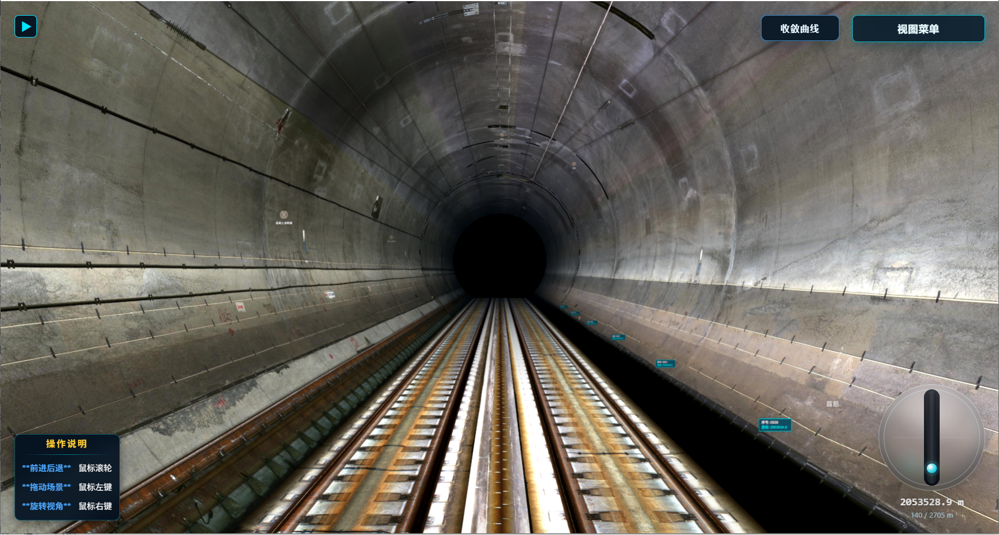

</div>

> [!IMPORTANT]
> 本仓库仅用于产品与技术成果展示，不提供源代码、安装包或原始工程数据。页面中的截图与 GIF 已移除单位、作者及本地路径等信息；未经授权，不得复制、分发或用于商业用途。

## 项目概览

隧道巡检数据通常分散在纹理影像、病害 JSON、断面扫描和轨道结构等不同来源中，数据命名、空间基准与粒度也并不一致。本系统先将矿山法隧道、盾构法隧道与 TLS-D 激光扫描项目归一为统一数据集，再通过 Three.js 构建连续的隧道场景，让巡检人员能够沿里程浏览内壁纹理、查看病害位置与详情，并结合收敛曲线和里程跳转完成快速复核。

它既可以在浏览器环境中运行，也可以封装为 Electron 桌面客户端。工程重点不只是“把隧道画出来”，而是让长距离、高分辨率纹理和密集标注在交互过程中保持可管理、可定位和可扩展。

## 动态演示

<p align="center">
  
  
</p>

<p align="center">
  
  
</p>

## 核心能力

### 1. 多源数据统一接入

系统提供“已有标准数据集、矿山法、盾构法、激光扫描”四类入口。不同导入器负责解析纹理命名、里程、环号、断面和病害坐标，经过校验后输出同一套数据契约，渲染层不再关心数据来自哪种采集流程。

<p align="center">
  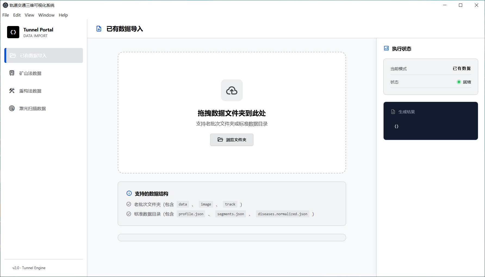
</p>

<p align="center">
  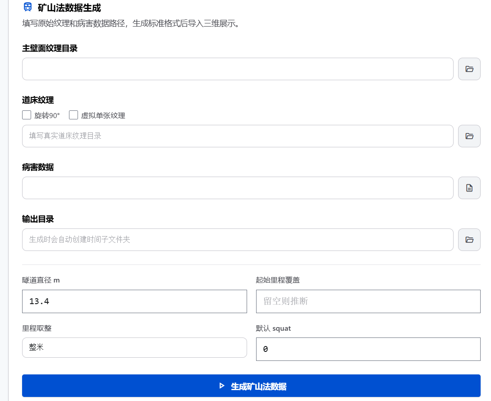
  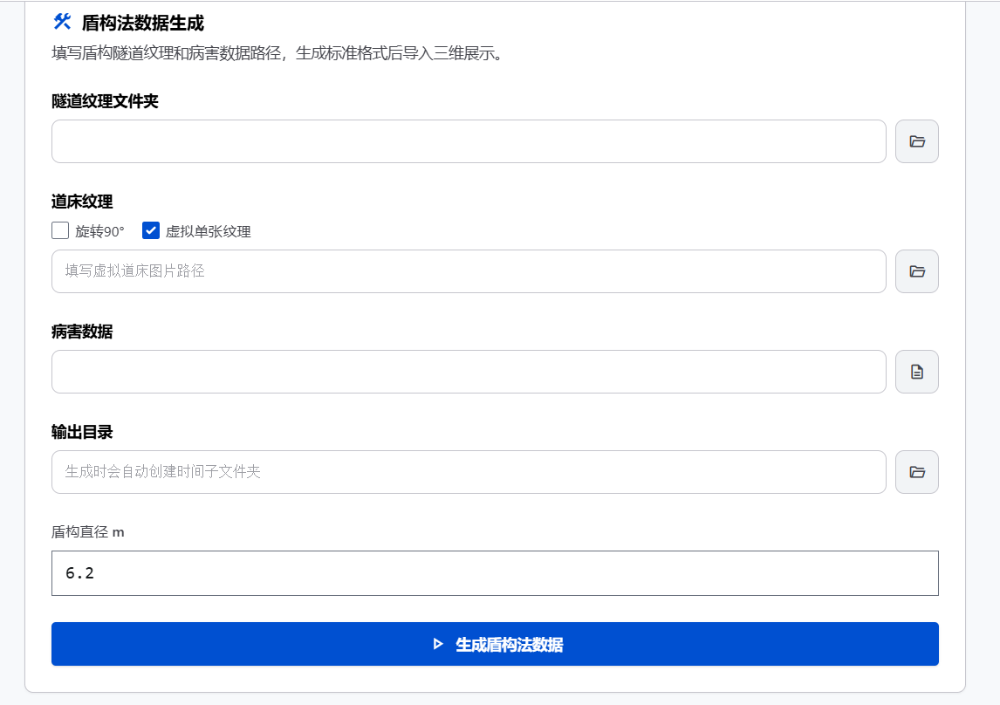
</p>

<p align="center">
  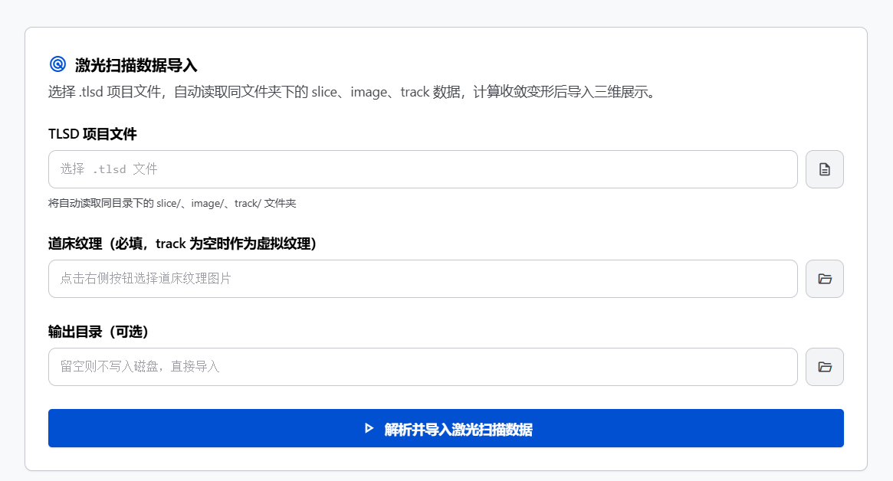
</p>

纹理文件的里程区间、分辨率与环号由导入器解析，而不是散落在场景代码中。

### 2. 多类型隧道场景重建

系统根据直径、分段长度、里程和壁面纹理构建隧道内壁、轨道或道床，并支持直线与曲线场景。矿山法、高铁、盾构和激光扫描数据在统一渲染框架下保留各自的结构与纹理特征。

<p align="center">
  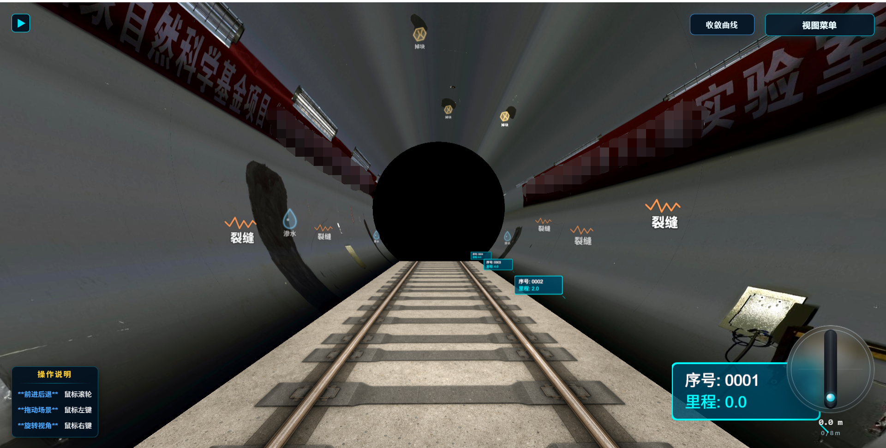
  
</p>

<p align="center">
  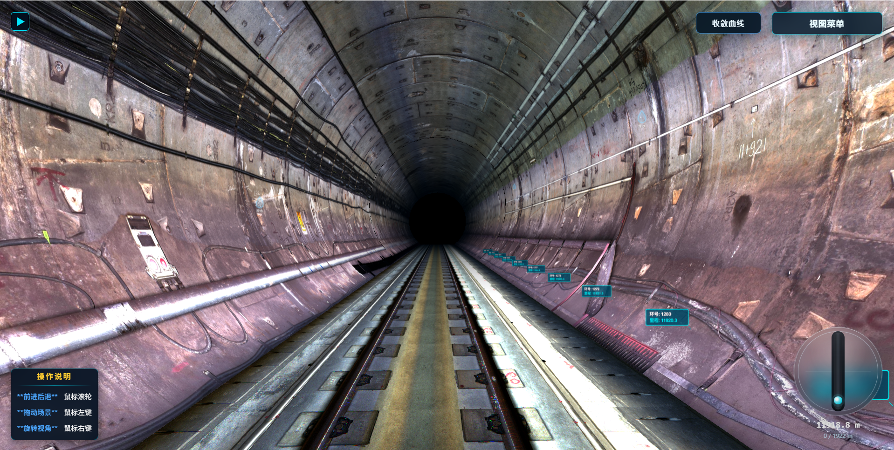
  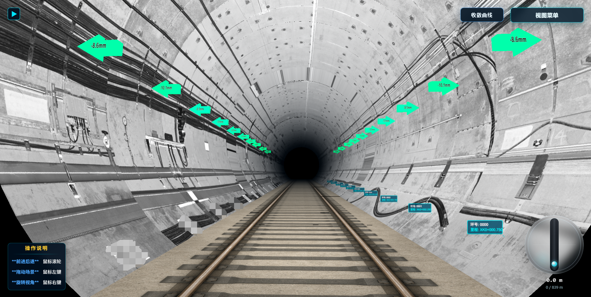
</p>

### 3. 病害空间映射与复核

病害适配层将不同来源的裂缝、渗漏水、混凝土浇筑缝等记录统一到里程与管片局部坐标系，再生成可拾取的标注和路径。点击标注可查看病害类型、环号、起止里程、长度或面积；当前环的病害列表也可以集中展开，支持从“全局巡检”下钻到“单条复核”。

<p align="center">
  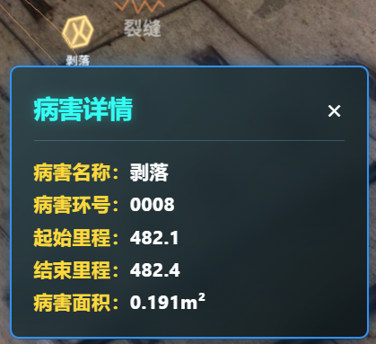
</p>

### 4. 里程导航与状态分析

浏览过程中，信息面板持续同步当前里程、环号与结构状态；小地图支持选点和里程跳转；收敛曲线则按环展示变形趋势。视图菜单还可以调节漫游速度、前进灵敏度、亮度、纹理对比度、雾化与病害标注强度。

<p align="center">
  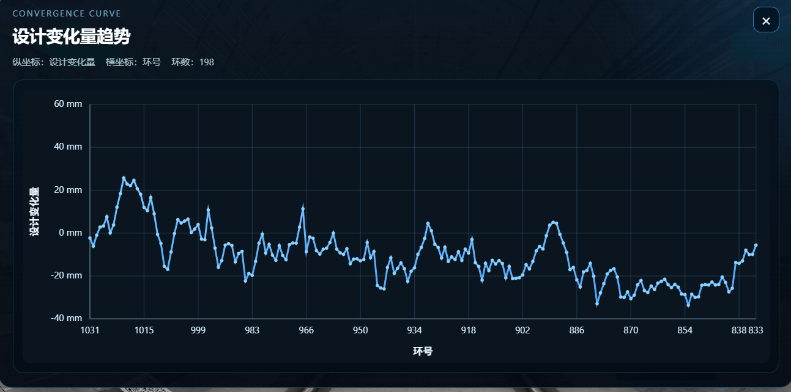
  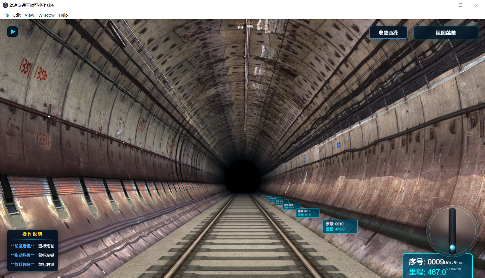
</p>

## 数据管线

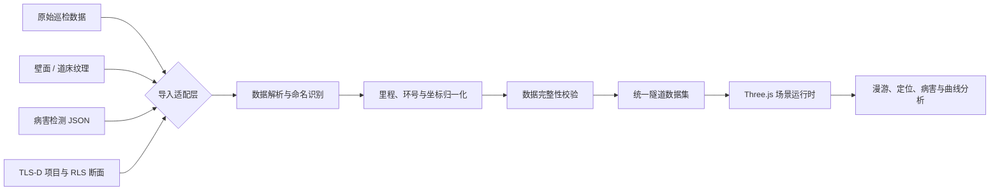

标准数据集以四个文件为边界，便于导入、渲染和后续分析模块独立演进：

```text
dataset/
├── profile.json                 # 隧道直径、分段方式、数据来源等全局配置
├── segments.json                # 环/分段、里程、纹理引用与收敛量
├── diseases.normalized.json     # 标准化病害、尺寸、里程与坐标点
└── import-report.json           # 解析结果、统计信息与数据质量警告
```

## 运行时架构

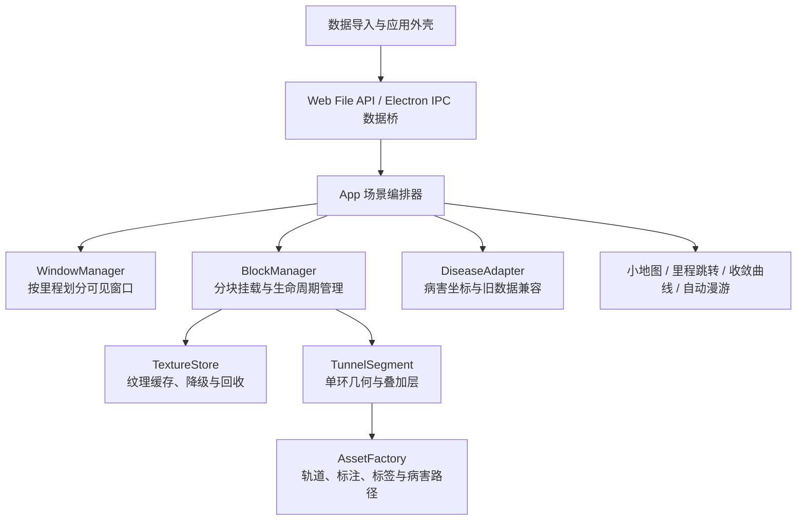

### 关键工程取舍

| 设计点 | 实现思路 | 解决的问题 |
| --- | --- | --- |
| 先标准化、后渲染 | 三类导入器统一生成 `profile`、`segments`、`diseases` 与导入报告 | 隔离数据差异，避免每种来源各写一套场景逻辑 |
| 里程驱动的滑动窗口 | 默认每 5 环组成一个块，保持 5 个可见块，其中 3 个使用高精度；切换时设置死区 | 长距离隧道无需一次性驻留全部几何和纹理 |
| 渐进式纹理质量 | 支持占位、低精度、高精度三级状态，并按移动方向预加载 | 先保证可见，再逐步提高清晰度，降低跳转等待 |
| 缓存与资源生命周期 | 纹理引用计数、加载超时、冷却回收，块卸载时显式释放几何和材质 | 控制显存增长，避免反复进出相邻区段造成抖动 |
| 速度感知的背压 | 高速移动或待处理加载过多时降低质量并暂停非必要预加载 | 在吞吐压力上升时优先保护帧率和交互响应 |
| 坐标适配层 | 将旧格式与预分类病害统一映射到管片局部空间 | 支持多类病害数据，同时保持渲染对象职责单一 |
| 双运行时数据桥 | 浏览器使用文件系统能力，桌面端通过预加载脚本和 IPC 访问本地数据 | 复用同一套前端与三维引擎，兼顾 Web 与桌面交付 |

## 交互闭环

```text
选择或生成数据集
        ↓
解析并校验统一数据契约
        ↓
按相机里程挂载当前窗口
        ↓
低精度快速可见 → 高精度渐进替换
        ↓
漫游 / 小地图跳转 / 病害点击 / 收敛趋势复核
        ↓
切换数据集或释放当前场景资源
```

## 技术栈

| 层级 | 技术 | 用途 |
| --- | --- | --- |
| 三维渲染 | Three.js 0.152 | 场景、相机、隧道几何、纹理、标注拾取与宽线病害路径 |
| 应用构建 | Vite 8 | Web 开发与生产构建 |
| 桌面运行时 | Electron 35 | 本地文件选择、IPC、文件桥接与桌面分发 |
| 桌面更新 | electron-updater 6 | 更新检查、下载进度与安装状态管理 |
| 界面样式 | Tailwind CSS 3 + 原生 CSS | 导入界面、控制面板与响应式布局 |
| 数据处理 | Node.js ES Modules | 矿山法、盾构法与 TLS-D 数据解析及标准化 |

## 展示仓库结构

```text
.
├── README.md
└── assets/
    ├── images/          # 典型隧道场景
    ├── gifs/            # 漫游与病害交互演示
    └── screenshots/     # 导入、分析与控制界面
```

## 展示边界

- 本仓库不是开源发行版，不包含源码、依赖清单、构建脚本、安装包或可运行数据集。
- 页面展示的是系统能力与工程思路，不构成对外 API 或数据格式的兼容性承诺。
- 截图中的示例数据仅用于说明交互流程，不代表真实线路的当前检测结论。
- 如需试用、技术交流或授权，请通过仓库维护者公开的 GitHub 联系方式沟通。

---

<div align="center">

**让分散的隧道巡检数据，进入同一条可浏览、可定位、可分析的三维链路。**

</div>
